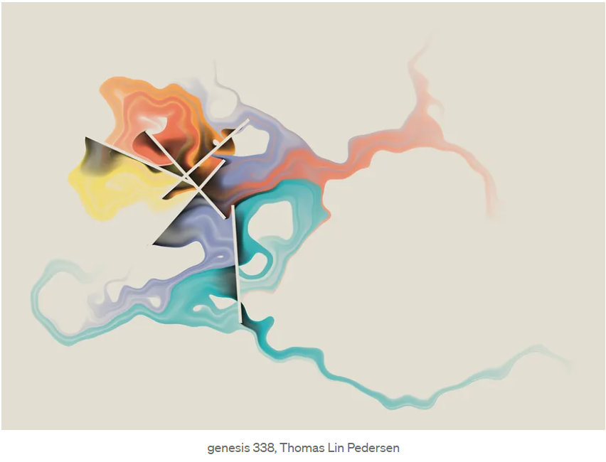

# Show & Tell Session 1
Keaton Markey
2024-03-01

<link href="index_files/libs/htmltools-fill-0.5.8.1/fill.css" rel="stylesheet" />
<script src="index_files/libs/htmlwidgets-1.6.4/htmlwidgets.js"></script>
<script src="index_files/libs/d3-4.5.0/d3.min.js"></script>
<script src="index_files/libs/sankey-1/sankey.js"></script>
<script src="index_files/libs/sankeyNetwork-binding-0.4/sankeyNetwork.js"></script>


# Intro

Data Visualization is a super important part of any project!

- Understand our data
- Understand what we are doing to the data
- Check our work

# Today’s agenda

- Answer questions with data viz
- Explore what R has to offer
- Look at some other R visualizations

## First steps

Let’s see what this data looks like:

``` r
head(penguins)
```

    # A tibble: 6 × 8
      species island    bill_length_mm bill_depth_mm flipper_length_mm body_mass_g
      <fct>   <fct>              <dbl>         <dbl>             <int>       <int>
    1 Adelie  Torgersen           39.1          18.7               181        3750
    2 Adelie  Torgersen           39.5          17.4               186        3800
    3 Adelie  Torgersen           40.3          18                 195        3250
    4 Adelie  Torgersen           NA            NA                  NA          NA
    5 Adelie  Torgersen           36.7          19.3               193        3450
    6 Adelie  Torgersen           39.3          20.6               190        3650
    # ℹ 2 more variables: sex <fct>, year <int>

How big is it?

``` r
dim(penguins)
```

    [1] 344   8

## Let’s get plotting!

Some questions:

- How many penguins are in each species
- How does weight differ by island?
- How are bill length and bill depth related?

**We’ll use ggplot (ggplot2)**

<!-- ::: {.callout-tip} -->
<!-- ## There's a package for that! -->
<!-- ::: -->

## How many penguins are in each species?

``` r
ggplot(data = penguins, mapping = aes(x = species)) +
  geom_bar()
```


## How many penguins are in each species?

<!-- :::: {.columns} -->
<!-- ::: {.column width="25%"} -->

#### Goals

- Add a title
- Make it look a little nicer

<!-- ::: -->
<!-- ::: {.column width="75%"} -->

``` r
ggplot(data = penguins) + 
  
  geom_bar(aes(x = species)) +
  
  # add a title
  labs(title = "Penguins by Species") +
  
  # make it look a little nicer
  theme_classic()
```


<!-- ::: -->
<!-- :::: -->

## How does weight differ by island?

``` r
penguins %>%
  
  ggplot() +
  
  geom_boxplot(aes(x = island, y = body_mass_g))
```


## How does weight differ by island?

<!-- :::: {.columns} -->
<!-- ::: {.column width="25%"} -->

#### Goals

- Add some axis labels and a title
- Change to pounds
- Make sure 0 is included in y scale
- Add some color – let’s use some branded colors!

<!-- ::: -->
<!-- ::: {.column width="75%"} -->

``` r
penguins %>%
  
  ggplot() +
  
  # change to pounds, add color
  geom_boxplot(aes(x = island, y = body_mass_g * 0.00220462, fill = island)) +
  
  # change labels and title
  labs(title = "A Buffet for Biscoe Penguins",
       x = "Island",
       y = "Body Mass (Lbs)") +
  
  # include 0 in scale
  lims(y = c(0, 6500 * 0.00220462)) +
  
  theme_economist() +
  
  # specify color
  scale_fill_manual(values = c("#003087", "#84BD00", "#00AEC7"), guide = "none")
```


## How are bill length and bill depth related?

``` r
penguins %>%
  
  ggplot() + 
  
  geom_point(aes(x = bill_length_mm, y = bill_depth_mm)) +

  # change labels and title
  labs(title = "Scatterplot of Bill Sizes",
       x = "Bill Length (mm)",
       y = "Bill Depth (mm)") +
  
  theme_classic()
```


## How are bill length and bill depth related?

<!-- :::: {.columns} -->
<!-- ::: {.column width="25%"} -->

#### Goals

- Color by groups
- Where is Martin?

<!-- ::: -->
<!-- ::: {.column width="75%"} -->

``` r
library(ggrepel)

named_penguins %>%
  
  ggplot() +
  # add color and transparency with alpha
  geom_point(aes(x = bill_length_mm, y = bill_depth_mm, color = species), 
             size = 3, alpha = 0.70) +
  # point out Martin!
  geom_text_repel(
    aes(x = bill_length_mm, y = bill_depth_mm, label = highlight),
    size = 5,
    nudge_x = .5,
    nudge_y = 1.5
  ) +
  # change labels and title
  labs(title = "Scatterplot of Bill Sizes",
       x = "Bill Length (mm)",
       y = "Bill Depth (mm)") +
  theme_classic() +
  # specify colors
  scale_color_manual(values = c("#003087", "#84BD00", "#00AEC7"),
                     name = "Species") +
  # move legend
  theme(legend.position = "top")
```


## Don’t forget about data manipulation!

- Half of the battle is getting the data formatted correctly before you
  start messing around with plots.

- It’s important to have a good foundation in data manipulation!

## Remove all of the NA’s in the data

``` r
penguins_clean <- penguins %>%
  
  na.omit()
```

<!-- [!TIP] -->
<!-- ## Use the `%>%` pipe! -->

#### Without

``` r
penguins_species_mean <-
  summarise(group_by(.data = penguins_clean, species), mass = mean(body_mass_g))
```

  

#### With

``` r
penguins_species_mean <- penguins_clean %>%
  
  group_by(species) %>%
  # put comment here
  summarise(mass = mean(body_mass_g))

penguins_species_mean
```

    # A tibble: 3 × 2
      species    mass
      <fct>     <dbl>
    1 Adelie    3706.
    2 Chinstrap 3733.
    3 Gentoo    5092.

## Plot

``` r
penguins_species_mean %>%
  
  ggplot() + geom_bar(aes(x = mass, y = species), stat = "identity")
```


# More examples!

## Lollipop Plot


## Ridgeline Plot


## Sankey Plot

<div class="sankeyNetwork html-widget html-fill-item" id="htmlwidget-8d84c9cad6f435b8569d" style="width:672px;height:480px;"></div>
<script type="application/json" data-for="htmlwidget-8d84c9cad6f435b8569d">{"x":{"links":{"source":[0,0,0,1,2,3,3,4,4,5,5],"target":[3,4,5,4,3,6,7,6,7,6,7],"value":[44,55,47,68,119,80,83,61,62,24,23]},"nodes":{"name":["Adelie ","Chinstrap ","Gentoo ","Biscoe ","Dream ","Torgersen ","female ","male "],"group":["Adelie ","Chinstrap ","Gentoo ","Biscoe ","Dream ","Torgersen ","female ","male "]},"options":{"NodeID":"name","NodeGroup":"name","LinkGroup":null,"colourScale":"d3.scaleOrdinal(d3.schemeCategory20);","fontSize":13,"fontFamily":null,"nodeWidth":40,"nodePadding":20,"units":"","margin":{"top":null,"right":null,"bottom":null,"left":null},"iterations":32,"sinksRight":false}},"evals":[],"jsHooks":[]}</script>

## More Abstract



# Final Thoughts

- There’s tons of theory and other things to worry about during data
  visualization!
- Next time: More visualization in R–maps, interactivity, dashboards
- Thank you!

## More Resources

- [More in-depth ggplot
  tutorial](https://www.cedricscherer.com/2019/08/05/a-ggplot2-tutorial-for-beautiful-plotting-in-r/)
- Visual Communication, Stephen Few
- [Soar Beyond the Dusty Shelf
  Report](https://depictdatastudio.teachable.com/p/soar-beyond-the-dusty-shelf-report)
- Most of these figures were inspired by [The R Graph
  Gallery](https://r-graph-gallery.com/index.html)
