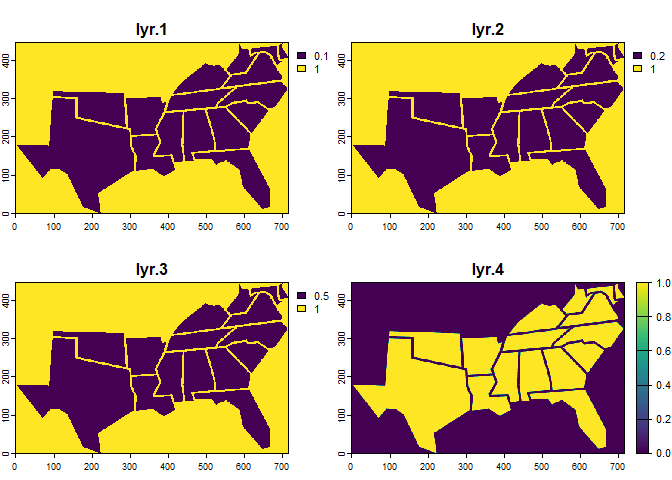
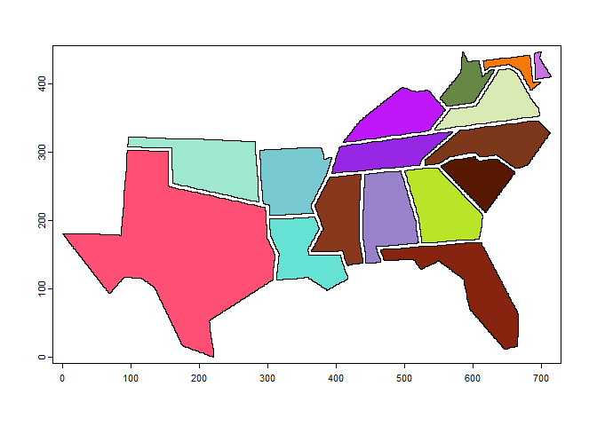

# Converting a .PNG to a shapefile with R
Keaton Markey
2024-07-16

\definecolor{srebblue}{HTML}{003087}
\definecolor{domblue}{HTML}{307FE2}
\definecolor{domgreen}{HTML}{84BD00}
\definecolor{domlightblue}{HTML}{00AEC7}
\definecolor{accentorange}{HTML}{FFA300}

## The Problem

My organization recently developed a stylized map of its member states.
Instead of fooling around with latitude and longitude, we adopted an
eye-catching, geometric design, which I quite like.


The only issue is that its an image, so I can’t make maps with it. I
would love to be able to change the color of each state based on its
population, median income, or some other statistic.

As I researched the problem, some suggested that I just use ArcGIS and
trace over the image to create my own polygons. There were two problems
with that:

1.  I was sure that the resulting polygons wouldn’t be an exact trace
    over the image, distorting the work of whoever made this map

2.  I don’t have ArcGIS

Surely there must be a way to do this in R?

## Solution

``` r
# to read in the image
library(png)

# to do some transformations
library(terra)
library(sf)

# tidyverse parts
library(dplyr)
library(ggplot2)
```

First, we need to read the image into R.

``` r
img <- png::readPNG("data/2023filledmap_blue.png")
```

This image is represented as a Large array. PNG files and a few other
image formats are stored as a matrix of values, where each value
represents a pixel color.

This is the format we want, but we need to translate it to a format that
{terra} will understand. For that we can use the `rast()` function.

``` r
img_raster <- terra::rast(img)

plot(img_raster)
```



R has encoded this object as a SpatRaster, a {terra}-native object that
has essentially the same structure as our original array: 3 dimensions
representing rows, columns, and layers.

The `rast()` function has identified 4 layers, each with different pixel
values. We’ll only need one for our operations.

### Polygons

In order to be able to *fill in* each state, we need to convert this
grid of pixels to closed polygons. A shapefile must map a state name to
polygons, points, or lines.

``` r
plygns <- terra::as.polygons(img_raster)

plot(plygns)
```


She’s gorgeous. Almost there!

If we take a quick look at this object, we can see that *there are
actually 2 polygons layers*, one of which contains a map with an extra
border.

``` r
dim(plygns)
```

    [1] 2 1

``` r
plot(plygns[2])
```


So, we’ll take the other one, and dis-aggregate the remaining polygons
into states. Let’s see if we can color in the states now.

``` r
multi <- terra::disagg(plygns[1])

plot(multi, col = c("#cc73e4", "#f67809", "#668746", "#daeab4", "#c017fa", "#7d371a", "#9826e5", "#9ee7d1", "#561801", "#79c9d0", "#b8e528", "#9a82ca", "#87381d", "#65e2d4", "#87240f", "#ff4f75"))
```



For the final step, we’ll move this object over to the {sf} package for
compatibility with ggplot, and then carefully add in the state names.
Since the polygons are sorted by total area, we can add in the state
names in that same order.

``` r
sf_states <- sf::st_as_sf(multi)

state_keys <- tibble(abb = state.abb, name = state.name)

sf_states <- bind_cols(sf_states, name = c("Delaware", "Maryland", "West Virginia", "Virginia", "Kentucky", "North Carolina", "Tennessee", "Oklahoma", "South Carolina", "Arkansas", "Georgia", "Alabama", "Mississippi", "Louisiana", "Florida", "Texas")
) %>% left_join(state_keys) %>%
  select(-lyr.1)


ggplot(sf_states) + geom_sf(fill = "red") + theme_minimal()
```


If we were planning on including this shapefile with others on the same
plot, we would want to scale and relocate relative to some projection,
otherwise it probably take over the map. Alas, we don’t need to do that
since it will only ever by used in isolation, by me.

``` r
sf::st_write(sf_states, "data/sf_states", driver = "GeoJSON", delete_dsn = TRUE)
```

    Deleting source `data/sf_states' using driver `GeoJSON'
    Writing layer `sf_states' to data source `data/sf_states' using driver `GeoJSON'
    Writing 16 features with 2 fields and geometry type Polygon.
